


 

 

 


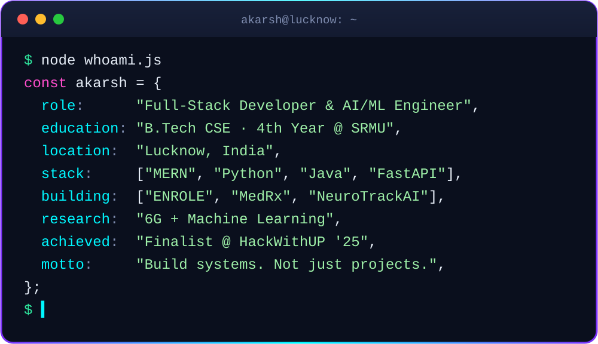

 

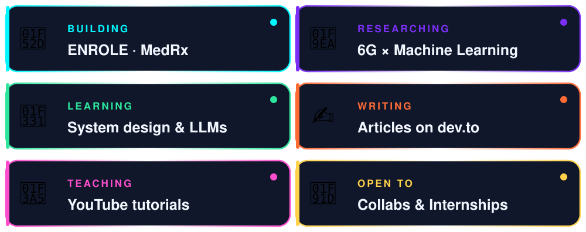

 


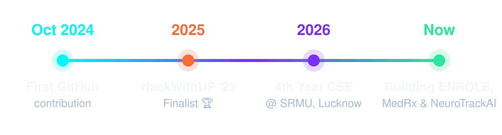

 


<table align="center">
<tr>
  <td align="right"><h3>Languages</h3></td>
  <td></td>
</tr>
<tr>
  <td align="right"><h3>Frontend</h3></td>
  <td></td>
</tr>
<tr>
  <td align="right"><h3>Backend</h3></td>
  <td></td>
</tr>
<tr>
  <td align="right"><h3>AI / ML</h3></td>
  <td></td>
</tr>
<tr>
  <td align="right"><h3>Databases</h3></td>
  <td></td>
</tr>
<tr>
  <td align="right"><h3>DevOps &amp; Tools</h3></td>
  <td></td>
</tr>
</table>

 


<table align="center">
<tr>
  <td width="50%"><a href="https://github.com/Code-AkarshMishra/ENROLE"></a></td>
  <td width="50%"><a href="https://github.com/Code-AkarshMishra/MedRx"></a></td>
</tr>
<tr>
  <td width="50%"><a href="https://github.com/Code-AkarshMishra?tab=repositories&q=neuro"></a></td>
  <td width="50%"><a href="https://github.com/Code-AkarshMishra/WeatherGPT"></a></td>
</tr>
<tr>
  <td width="50%"></td>
  <td width="50%"><a href="https://github.com/Code-AkarshMishra?tab=repositories&q=mahakal"></a></td>
</tr>
<tr>
  <td width="50%" colspan="2" align="center"><a href="https://github.com/Code-AkarshMishra/Sparsh-Trading"></a></td>
</tr>
</table>

 


<table>
<tr>
  <td width="50%"></td>
  <td width="50%"></td>
</tr>
</table>

 

<picture>
  <source media="(prefers-color-scheme: dark)" srcset="https://raw.githubusercontent.com/Code-AkarshMishra/Code-AkarshMishra/output/github-snake-dark.svg"/>
  <source media="(prefers-color-scheme: light)" srcset="https://raw.githubusercontent.com/Code-AkarshMishra/Code-AkarshMishra/output/github-snake.svg"/>
  
</picture>

 


 

<table>
<tr>
  <td width="50%"></td>
  <td width="50%"></td>
</tr>
<tr>
  <td width="50%"></td>
  <td width="50%"></td>
</tr>
</table>

 


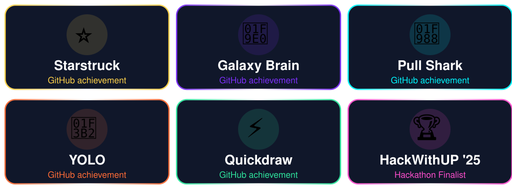
  

 


  

 


<!-- Auto-updated by .github/workflows/blog-posts.yml (dev.to feed) -->
<!-- BLOG-POST-LIST:START -->
<!-- BLOG-POST-LIST:END -->

 

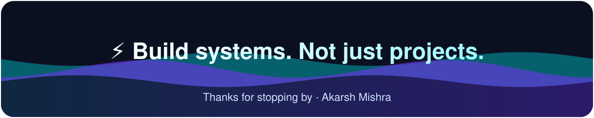
